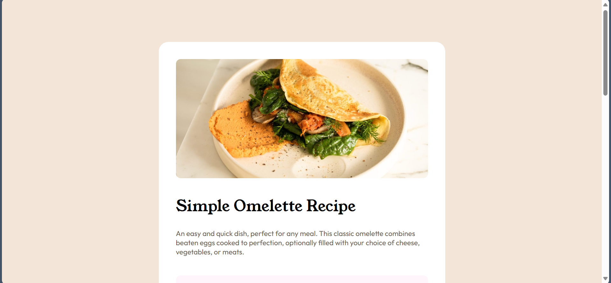
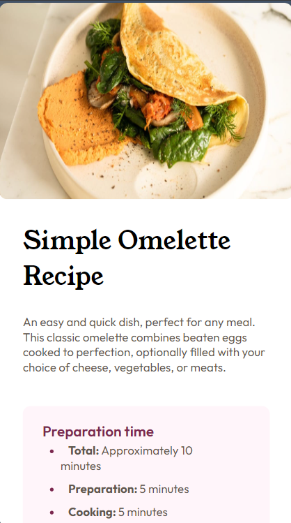

# Frontend Mentor - Recipe page solution

This is a solution to the [Recipe page challenge on Frontend Mentor](https://www.frontendmentor.io/challenges/recipe-page-KiTsR8QQKm). Frontend Mentor challenges help you improve your coding skills by building realistic projects. 

## Table of contents

- [Overview](#overview)
  - [Screenshot](#screenshot)
  - [Links](#links)
- [My process](#my-process)
  - [Built with](#built-with)
- [Author](#author)
- [Acknowledgments](#acknowledgments)

## Overview

### Screenshot

### Links

- Solution URL: [https://github.com/Huzaif-Hilal/recipe-page]

- Live Site URL: [https://omelette-recipe-by-huzaif.netlify.app/]

## My process

### Built with

- Semantic HTML5 markup
- CSS custom properties
- Flexbox
- Desktop-first workflow

## Author

- Website - Huzaif Hilal (https://social-links-profile-template.netlify.app/)
- Frontend Mentor - [@Huzaif-Hilal](https://www.frontendmentor.io/profile/Huzaif-Hilal)
- Instagram - [@bhat_huzaif_94](https://www.instagram.com/bhat_huzaif_94)
- GitHub - [@Huzaif-Hilal](https://www.github.com/Huzaif-Hilal)
